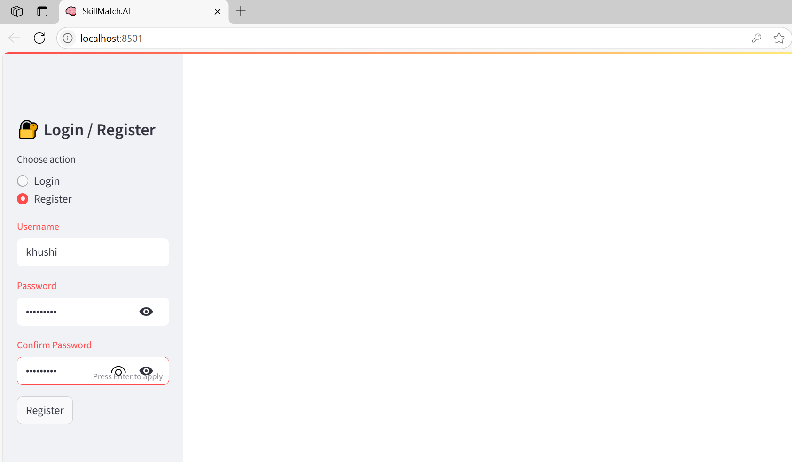
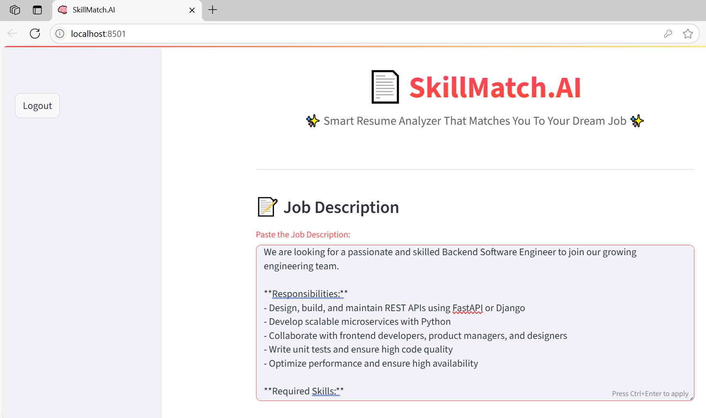
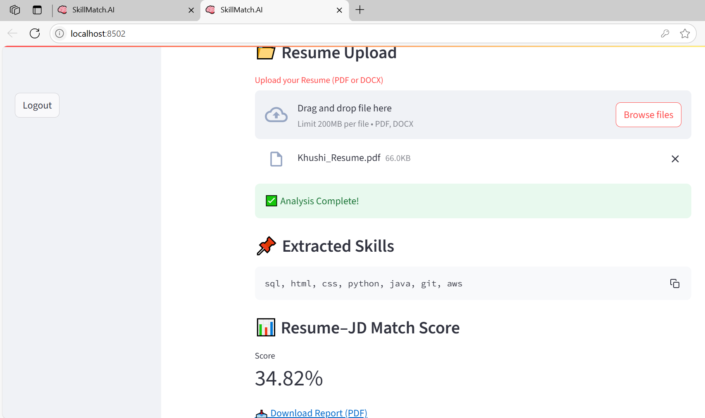

# 📄 SkillMatch.AI

**Smart Resume Analyzer That Matches You to Your Dream Job 🚀**

SkillMatch.AI is an intelligent NLP-powered resume analyzer built using **FastAPI (backend)** and **Streamlit (frontend)**. It parses your resume, extracts relevant skills, and matches them against a job description to calculate a compatibility score — all in a beautifully interactive UI.

---

## ✨ Features

- 🔐 User authentication & login system
- 📝 Resume upload & JD input
- 🧠 Skill extraction using NLP
- 📊 Resume–Job Description Match Score
- 📥 Downloadable PDF report
- 📜 User-specific resume analysis history with delete option
- 📈 Score trend visualization using charts

---

## 🛠️ Tech Stack

- **Frontend:** `Streamlit`, `FPDF`, `Matplotlib`, `SQLite`  
- **Backend:** `FastAPI`, `SpaCy`, `Uvicorn`  
- **NLP Libraries:** `spaCy`, `re`, `sklearn`, `HuggingFace Transformers`, `sentence-transformers`  
- **Deployment:** `Render`, `GitHub`

---
## 📸 Demo Screenshots

### 🔐 Registration Page  

### 📝 Resume Analysis  

### 📥 PDF Report Download  

## 📂 Project Structure

skillmatch-ai/
│
├── app/ # FastAPI backend logic
│ ├── main.py
│ ├── resume_parser.py
│ ├── extractor.py
│ └── matcher.py
│
├── frontend/ # Streamlit frontend UI
│ ├── app.py
│ ├── auth.py
│ ├── auth_db.py
│ ├── requirements.txt
│ └── users.db (SQLite user data)
│
├── requirements.txt # Backend dependencies
├── start.sh # FastAPI start script
├── README.md

---

## 🧪 Local Setup Instructions

### 🔧 1. Clone the Repo

bash: 

git clone https://github.com/Khushi0389/skillmatch-ai.git
cd skillmatch-ai
🖥️ 2. Backend Setup
bash:

pip install -r requirements.txt
uvicorn app.main:app --reload
💻 3. Frontend Setup
bash:

cd frontend
pip install -r requirements.txt
streamlit run app.py
🔒 Authentication
Secure registration & login system

Passwords are hashed using SHA-256

SQLite database (users.db) stores credentials & user history

Resume history includes scores and extracted skills

📈 Sample Output
Skill Extraction: python, sql, aws, docker

Match Score: 74.23%

Downloadable Report: PDF format

📊 Resume History Dashboard
Every user can view their uploaded resume analyses

Charts to visualize performance trends

Option to delete entries

🧾 License
MIT License © 2025 Khushi Gupta

🙌 Contribute
Got an idea or improvement? Fork it, branch it, push it, and submit a PR!

